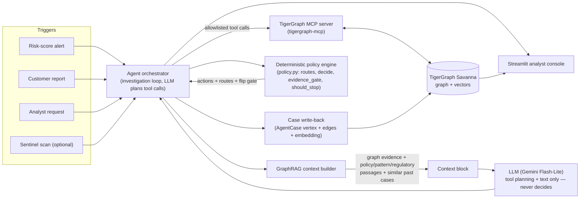

# HHGOA — Agentic Fraud Investigation on TigerGraph

An AI agent that investigates card fraud the way a bank's fraud analyst would: it opens a case
from a trigger, pulls the transaction history, the device and region neighbourhood, and prior
cases out of a TigerGraph knowledge graph, weighs prosecution evidence against innocent
explanations, and recommends a next best action with an approval route — asking for one more
piece of evidence only when that evidence could actually change the outcome. A deterministic
policy engine, not the LLM, makes every decision; the LLM plans tool calls and writes the
prose. Every investigated case is written back to the graph as an `AgentCase` vertex, so it
becomes evidence for the next one.

Built for the TigerGraph Agentic Fraud Investigation hackathon (Hacker House Goa), on
TigerGraph Savanna's free tier.

## Architecture



The MCP server is the agent's *only* interface to the graph — no direct database driver in the
agent code. The LLM sits between the context builder and the orchestrator: it never sees a
raw table dump and it never picks the action; `policy.py` does that from a plain `findings`
dict the agent assembles from graph and vector results.

## How TigerGraph is used

**Schema** (`gsql/schema.gsql`), built on the README's suggested schema plus case memory and a
GraphRAG document store:

| Vertex | Key attributes | Purpose |
|---|---|---|
| `Customer` | id | Anchor for a cardholder's cards |
| `Card` | network, card_type | `(customer, card network, credit/debit)` — there is no `card_id` column in the raw data, so this is derived and verified against every closed case |
| `Txn` | ts, amount, product, channel, risk, addr1/addr2, dist1, emails, M-flags, `model_score` | One transaction; `model_score` is the gradient-boosting fraud score from `train_model.py` |
| `DeviceProfile` | device_info, os, browser, screen, device_type | DeviceInfo + OS + browser + screen, the unit a device ring is built on |
| `EmailDomain` | id | Purchaser/recipient email domain |
| `Region` | id | Billing region (`addr1`) |
| `ClosedCase` | outcome, pattern, opened_at/closed_at, n_txns, exposure, actions, report_filed, notes | The bank's 5,565 finished investigations — labelled history and case memory |
| `AgentCase` | case_id, status, verdict, pattern, probability, exposure, summary, `answer_json` | A case *this* agent opened, written back so later investigations retrieve it |
| `Doc` | source, section, title, text | One GraphRAG chunk (policy / pattern / regulatory / typology text) |

`ClosedCase.emb`, `AgentCase.emb`, and `Doc.emb` are 384-dimension COSINE vector attributes
(`BAAI/bge-small-en-v1.5`, run locally), added via a schema-change job so the same graph holds both the
relationship data and the retrieval index — no separate vector database.

Edges are undirected for simple bidirectional traversal: `OWNS` (Customer→Card), `MADE`
(Card→Txn), `FROM_DEVICE` (Txn→DeviceProfile, carrying `dev_status`/`proxy_type` — the
account/device relationship, not a device property, so it lives on the edge), `PURCHASER_EMAIL`,
`RECIPIENT_EMAIL`, `BILLED_IN`, `INVOLVES`/`ON_CARD`/`CONNECTED_TO` (Closed/AgentCase→Txn/Card),
`LINKS_DEVICE` (AgentCase→DeviceProfile), `SIMILAR_TO` (AgentCase→ClosedCase), `CITES`
(AgentCase→Doc).

**Eight installed GSQL queries** (`gsql/queries.gsql`), each a targeted traversal rather than a
raw dump — this is the "pass context, not raw data" requirement enforced at the query layer,
before GraphRAG assembly even starts:

| Query | What it returns | Why |
|---|---|---|
| `card_history` | A card's transactions in a window with device/proxy/new-device flags | Builds the timeline; feeds R5 card-testing detection |
| `device_neighbors` | Every card that used a device profile in a window, their activity and their closed/agent cases | Core prosecution evidence — who else this device touched; the query that lights up a device ring (HHG-014) |
| `region_cluster` | Cards new to a billing region in a window, and their cases | R6 region-cluster detection, and the defence check — "is this a trip, not a clone?" |
| `customer_cases` | A customer's cards and every closed/agent case on them | R10 (two cards confirmed fraud → `BLOCK_ALL_CARDS`), and general case memory |
| `similar_cases` | `vectorSearch({ClosedCase.emb, AgentCase.emb}, qv, k)` | GraphRAG case memory — nearest past investigations, cited in `similar_prior_cases` |
| `search_docs` | `vectorSearch({Doc.emb}, qv, k)` | GraphRAG grounding — nearest policy/pattern/regulatory passages |
| `device_ring_scan` | Device profiles marked `New` across several cards in a window | Undocumented-pattern discovery: the device-profile ring (Samsung SM-G935F / Chrome Android / anonymous proxy) |
| `near_threshold_scan` | Cards with several online purchases just under a threshold | Undocumented-pattern discovery: sub-$500 structuring (4 purchases in 30 minutes, HHG-006) |

The last two are the sentinel-mode queries: they scan the November–December window on their
own initiative rather than answering a single case, which is how the two undocumented
typologies were found.

**Vectors and the model.** TigerGraph's native `vectorSearch` (via `similar_cases` and
`search_docs`) is the retrieval algorithm — used instead of a general community-detection
algorithm because it is deterministic to explain (a cited distance to a named case or document
beats an unlabelled cluster ID) and cheap on the free tier. Ring and structuring detection use
targeted GSQL pattern-matching queries (`device_ring_scan`, `near_threshold_scan`) over the
same graph rather than an unsupervised graph algorithm, for the same reason. `Txn.model_score`
is written once from `scripts/train_model.py` (a gradient-boosting model trained on the bank's
own 5,565 closed cases) and stored as a graph attribute, so the agent can read it like any
other evidence field through MCP rather than calling out to a separate scoring service.

## Agent loop

The brief's 8-step investigation flow, as implemented:

| # | Brief step | Implementation |
|---|---|---|
| 1 | **Trigger** | One of the 20 case-pack rows (`risk_score`, `customer_report`, `analyst_request`), or a sentinel scan hit. The agent only looks at data up to `opened_at` — no look-ahead; that includes case memory: `AgentCase`s created at or after this case's `opened_at` are excluded from retrieval |
| 2 | **Investigate** | `card_history`, `device_neighbors`, `region_cluster`, `customer_cases` via MCP build the neighbourhood: the flagged card's timeline, who shares its device/region, and its owner's case history |
| 3 | **Gather evidence** | `similar_cases` and `search_docs` retrieve nearest closed/agent cases and policy/pattern/regulatory passages; the GraphRAG context builder condenses graph results + retrieved text into one context block for the LLM |
| 4 | **Assess uncertainty** | The agent builds prosecution hypotheses (device ring, rare-device shared origin, shared region, testing sequence, account history in a confirmed case, connects to other fraud) and defence hypotheses (trip, new phone, recurring charge, stated intent — the bank's three cleared archetypes — plus a clean account history) and tests each as hard as the other ("courtroom"); `fraud_probability` is calibrated from this plus `model_score` (see below); `policy.decide()` turns findings into an initial action set |
| 5 | **Gather more evidence if needed** | `policy.evidence_gate()` — the decision-flip test: it re-runs `decide()` under every possible response to the cheapest applicable evidence request (customer validation, step-up auth, analyst info) and only asks if some response would actually change the action set. No flip, no ask. When it does ask and 0.30 < p < 0.70, the request is recorded but no answer is presumed: the case stays open/escalated as `uncertain`. Outside that band it simulates the reply the evidence points to and says so |
| 6 | **Take next actions** | `policy.decide()` again on the findings updated with the simulated response, producing `next_best_actions.final` (route: `auto`/`L1`/`L2`) |
| 7 | **Explain the decision** | Every action carries a reason citing the policy rule (R1–R10, §2–§6); the LLM writes the `summary` and, when required, the SAR `narrative` from the same evidence list — it does not invent the reasoning, it phrases it |
| 8 | **Update case memory** | The case is upserted as an `AgentCase` vertex with `INVOLVES`/`ON_CARD`/`CONNECTED_TO`/`LINKS_DEVICE`/`SIMILAR_TO`/`CITES` edges and its own embedding, so `similar_cases` can retrieve it for the next investigation |

`policy.should_stop()` is the single stopping rule for step 5/6: stop once probability is
≥0.85 or ≤0.15 on at least two independent pieces of evidence, a verification response settles
it, or the evidence gate returns no decisive question.

**How the probability is built** (`src/hhg/analytics.py`, calibrated by `scripts/eval_analytics.py`):

- **Model score.** `Txn.model_score` comes from a model whose negatives are a 15% sample of *all*
  unlabelled Jul–Oct transactions, including those on cards with cases. Excluding them taught the
  model "card has case history = fraud", when the closed cases already hold about all the fraud.
- **Calibration.** A logistic fit over the flagged transaction's and its episode's scores, the
  episode size and a new-phone signature. `trip_signature` is shown as defence evidence but is not
  a calibration feature: as coded it fired on 71% of confirmed out-of-region cases and only 8% of
  cleared travel, so a fit would have read a trip as fraud.
- **Account history** (`_account`). A card mixes several accounts; an account is card + billing
  region `addr1` + (txn date − D1) within ±1 day. The agent reads which of the card's
  transactions sit in its closed cases through MCP `get_neighbors` (ClosedCase–`INVOLVES`–Txn).
  A clean account (≥5 earlier txns at least 7 days before the flag, none in any closed case) caps
  p at 0.15 unless card testing, structuring or a ring fired — 0.17% of in-person txns on such accounts were fraud (n=18,055). An earlier txn of the
  account in a confirmed case is prosecution evidence and floors p at 0.9 when the bank risk score
  is ≥0.5 (97.2% fraud, n=431). This is what turned HHG-001 legitimate: a clean account in
  region 444.
- **Rare-device shared origin (R6).** A rare device profile (≤20 cards ever) plus the same
  purchaser/recipient email pair on ≥2 other cards, from 7 days before the flag up to opening,
  adds those cards as connected cards, with `FILE_REPORT` and `MONITOR_CONNECTED_CARDS`. It only
  applies when the evidence already leans fraud (in Aug–Oct, 47.8% of such matches were fraud vs
  11.2% without) and never moves p. HHG-019 links C06224-K2 and C11309-K1 this way, HHG-011
  links C03938-K1 and C05595-K1.
- **Evidence gate band.** Between 0.30 and 0.70 a simulated reply would only echo the agent's own
  guess, so the request is left pending and the case stays open (HHG-012, 013, 017, 018).

## Controls & permissions

- **The LLM never decides.** `policy.py` is pure functions over a `findings` dict — no LLM call
  in `decide`, `evidence_gate`, `should_stop`, `needs_case`, `needs_sar`, or `route`. The LLM's
  role is bounded to tool-call planning and turning already-decided findings into prose
  (summary, SAR narrative, undocumented-pattern description).
- **Approval routing** (README §2, enforced by `policy.route`):

  | Route | Who acts | Actions |
  |---|---|---|
  | `auto` | The agent, alone | `ALLOW_TRANSACTION`, `MONITOR_CARD`, `MONITOR_CONNECTED_CARDS`, `WARN_CUSTOMER`, `VERIFY_WITH_CUSTOMER`, `STEP_UP_AUTH`, `GENERATE_REPORT`, `CREATE_CASE`, `ESCALATE_TO_ANALYST`, `CLOSE_NO_FRAUD` |
  | `L1` | Team lead | `DECLINE_TRANSACTION`; `BLOCK_CARD` when exposure ≤ $2,500 |
  | `L2` | Fraud manager | `BLOCK_CARD` when exposure > $2,500; `BLOCK_ALL_CARDS` (always); `FILE_REPORT` (always) |

  `BLOCK_ALL_CARDS` additionally requires two of the customer's cards showing confirmed fraud
  or confirmed compromised credentials (R10) — never triggered by a single card's evidence.
- **Human sign-off** (`src/hhg/approvals.py`, console tab *Evidence & approval*). The agent
  only executes `auto` actions; each `L1`/`L2` action waits for a person. The console's
  signed-in role decides who may sign: a team lead signs `L1`, a fraud manager signs `L1` and
  `L2`, and nobody signs `auto`. Every approve/reject is appended to `audit/approvals.jsonl`
  (git-ignored runtime data) with the time, analyst, role, note and the evidence replies the
  signed recommendation rests on. Entries are only ever added, never rewritten.
- **MCP tool allowlist.** `tigergraph-mcp` exposes ~69 tools; the agent's allowlist is
  restricted to what an investigation needs and nothing that can alter schema or delete data:
  the 8 installed queries via `tigergraph__run_installed_query` (vector retrieval included, through
  `similar_cases`/`search_docs`), `get_graph_schema`/`get_node`/`get_neighbors` for ad-hoc
  lookups, and `add_node`/`add_edges`/`upsert_vectors` for case write-back only
  (`ALLOWED_TOOLS` in `src/hhg/mcp_tools.py`).
  `tigergraph__gsql`, `tigergraph__install_query`, and any drop/delete tool are not on the
  allowlist — schema and query changes are a deploy-time step (the `gsql/` files, step 4 of
  Setup & run), not something the running agent can do to itself.
- **Simulated actions.** Per the brief, actions that would touch a real customer or system
  (SMS/email validation, step-up auth, CRM update, card block/reissue) are simulated: the
  assumed response is recorded in `evidence_requests[].assumed_response`, never fabricated
  silently — and when the evidence is balanced (0.30 < p < 0.70) no response is assumed at all.

## Setup & run

1. **TigerGraph Savanna.** Create a workspace at https://savanna.tgcloud.io (4.2.5+, needed for
   vectors). **Enable both auto-stop and auto-resume** — mandatory per the brief, and the only
   way the workspace survives judging without manual babysitting.
2. **Environment.** Copy `.env.example` to `.env` and fill in `TG_HOST`, `TG_GRAPHNAME`
   (`FraudGraph`), `TG_SECRET` (a database secret — the only TigerGraph credential the code
   reads; the REST client mints a token from it and the MCP server receives it), and the LLM
   block (`LLM_API_KEY`, `LLM_BASE_URL`, `LLM_MODEL` — Gemini Flash-Lite via its
   OpenAI-compatible endpoint by default; a Groq fallback is documented in the same file).
   `.env` is never committed.
3. **Install.** `pip install pandas pyarrow scikit-learn openai fastembed mcp tigergraph-mcp
   pyTigerGraph streamlit python-dotenv requests` inside `D:\hhgoa\.venv`. Run everything
   with `PYTHONPATH=src`. The raw `transactions.csv` (~708 MB) is not kept in `dataset/`: the
   scripts read it from `_dl/transactions.csv`; everything else comes from `dataset/`.
4. **Create the graph** — run the three GSQL files in order against the workspace, e.g. in the
   Savanna GSQL editor or through the REST client
   (`python -c "from hhg import tg; print(tg.gsql(open('gsql/schema.gsql').read()))"`):
   `gsql/schema.gsql` (vertices, edges, `FraudGraph`, the 384-d vector attributes),
   `gsql/load_jobs.gsql` (the loading jobs), then `gsql/queries.gsql` followed by
   `USE GRAPH FraudGraph` / `INSTALL QUERY ALL` (the file creates the 8 queries but does not
   install them).
5. **Train the model** — `python scripts/train_model.py`: a `HistGradientBoostingClassifier`
   labelled from `closed_cases_history.csv` (confirmed fraud = 1, cleared = 0, plus a 15% sample
   of all unlabelled July–October transactions = 0, including those on cards that have cases —
   the closed cases hold about all the fraud, and leaving those cards out taught the model "card
   has case history = fraud"), time-split validated (train on
   cases opened Jul–Aug, test on Sep–Oct), writing a score for every transaction to
   `data_prep/txn_scores.parquet` and the metrics to `data_prep/model_report.json`.
6. **Prepare the data** — `python scripts/prepare_data.py`: reads `_dl/transactions.csv`
   and `dataset/identity.csv`, derives `card_id` as `(customer, card network, credit/debit)`
   and verifies it against every transaction of every closed case and case-pack row, merges
   the scores from step 5 as `model_score`, and writes the load files (`data_prep/txn_*.csv`,
   `device.csv`, `closed_case*.csv`). It needs `txn_scores.parquet`, so it runs after step 5.
7. **Calibrate** — `python scripts/eval_analytics.py`: replays the closed cases through
   `hhg.analytics`, fits on cases opened Jul–Aug, reports on the September holdout, and writes
   `data_prep/calibration.json` (committed). It needs `txn_scores.parquet` from step 5, and
   builds its Jul–Oct 1 transaction slice (`data_prep/partial.pkl`) from `_dl/transactions.csv`
   on first run. `--no-write` reports without overwriting `calibration.json`.
8. **Build the knowledge corpus** — `python scripts/build_knowledge.py`: chunks the bank
   policy, the five patterns, and the regulatory sources listed in `knowledge/SOURCES.md` into
   `knowledge/chunks.jsonl` (68 chunks). Then `python scripts/embed_corpus.py` embeds those
   chunks plus the closed-case narratives locally with `BAAI/bge-small-en-v1.5` (fastembed,
   384-d), writing `data_prep/docs.csv`, `emb_doc.txt`, `emb_closed.txt`.
9. **Load the graph** — `python scripts/load_graph.py [device|txn|cases|docs|emb ...]`: posts
   the `data_prep/` files to the loading jobs from step 4 (devices, transactions with their
   customers/cards/regions/emails, closed cases and their edges, GraphRAG docs, and the
   embeddings), then prints vertex counts. It does not create schema or install queries.
10. **Run the benchmark** — `python scripts/run_benchmark.py`: runs the agent over all 20 rows
   of `dataset/case_pack.csv` in `opened_at` order, writing one `cases/<case_id>.json` answer
   file and one `cases/traces/<case_id>.json` trace file per case, then validates them.
11. **Sentinel (optional)** — `python scripts/sentinel.py [--dry-run] [--max N]`: scans
   Nov–Dec for device rings, sub-$500 structuring, and high model-score bursts, investigates
   each alert with the same agent, and writes `sentinel_cases/SEN-0xx.json`, `traces/`, and
   `SUMMARY.md` — scored under Innovation, not accuracy.
12. **Validate** — `python -m hhg.validate cases/ --txn-amounts _dl/transactions.csv`:
   checks every answer file against the README's Answer Format schema; `--txn-amounts`
   (any CSV with `TransactionID` and `TransactionAmt` columns) adds the
   `exposure_usd == sum(affected amounts)` check.
13. **Run the console** — `streamlit run ui/app.py`: reads `cases/*.json` and
    `cases/traces/*.json` directly, with no TigerGraph or LLM call. Shows, per case: header (status,
    verdict, pattern, probability, exposure), investigation timeline, courtroom
    (prosecution/defence hypotheses), evidence list, graph neighbourhood, the evidence-gate
    flip table, initial-vs-final actions with routes, and the SAR preview. The *Evidence &
    approval* tab starts from the agent's findings before it asked for anything
    (`trace.findings`): pick the reply that came back (customer deny/confirm/no reply,
    step-up pass/fail, analyst fraud/legitimate) and the policy engine re-decides on the
    spot — actions, routes, status, SAR, probability. It is preset to the replies the agent
    assumed, so it opens on the recorded answer (`tests/test_replay.py` checks that for all
    20 cases). Below it, the `L1`/`L2` actions can be approved or rejected (see *Controls &
    permissions*). **Investigate live** runs the real agent on the case's trigger as a dry run:
    TigerGraph over MCP plus the LLM, nothing written to `cases/` or the graph. It streams each
    step as it completes and compares the result with the recorded answer. It needs `.env` and a
    reachable Savanna workspace (about 30 s per case).

## Repo layout

```
dataset/                  README, identity.csv, closed_cases_history.csv, case_pack.csv (CSVs git-ignored)
_dl/                      transactions.csv (~708 MB, read by prepare_data.py / train_model.py; git-ignored)
gsql/                     schema.gsql, queries.gsql, load_jobs.gsql
knowledge/                SOURCES.md, chunks.jsonl, raw/ (downloaded regulatory PDFs/HTML; git-ignored)
data_prep/                model_report.json, calibration.json (committed); generated load files,
                           embeddings and txn_scores.parquet (git-ignored)
src/hhg/
  config.py                 .env loader
  tg.py                     TigerGraph REST client (bulk load + admin only — the agent uses MCP)
  mcp_tools.py              the agent's only path to the graph: tigergraph-mcp client + tool allowlist
  analytics.py              card/episode/device/region analytics and calibrated fraud probability
  policy.py                 deterministic Fraud Policy engine (pure functions)
  approvals.py              L1/L2 sign-off rules + append-only audit log
  validate.py                answer-file validator
  llm.py                     OpenAI-compatible client (Gemini/Groq) + deterministic fallback text,
                             local bge-small embeddings (fastembed)
  rag.py                     GraphRAG context builder
  agent.py                   investigation loop
scripts/                  train_model.py, prepare_data.py, eval_analytics.py, build_knowledge.py,
                           embed_corpus.py, load_graph.py, run_benchmark.py, sentinel.py
cases/                    HHG-0xx.json answer files; cases/traces/ agent trace files
sentinel_cases/           optional out-of-benchmark finds (device ring, structuring)
ui/app.py                 Streamlit analyst console
audit/                    approvals.jsonl, written by the console (git-ignored)
tests/                    unittest (python -m unittest discover -s tests)
docs/                     BLOG.md, SOCIAL.md, DEMO_SCRIPT.md
```

## Data-rule compliance

- The original Kaggle/IEEE-CIS files are never downloaded or used, at any stage — only the
  dataset files provided for this task.
- `card_id` is derived, not given: `(customer_id, card4, card6)`, verified before use against the
  card of every transaction in `closed_cases_history.csv` and `case_pack.csv` (14,975/14,975 match).
- Every case investigation reads data only up to that case's `opened_at`; closed cases are
  bounded July–October, the case pack is November–December, and no case pack row is used as
  training signal for `train_model.py`.
- Every ID emitted in an answer file (`affected_txn_ids`, `connected_card_ids`,
  `connected_device_profiles`, `similar_prior_cases`, SAR `subjects`) is checked by
  `hhg.validate` to exist in the provided dataset — no invented IDs.

## Results

Agent output on the 20 benchmark cases (`cases/HHG-*.json`, all 20 valid under `hhg.validate`;
#req = evidence requests, routes in brackets):

<!-- RESULTS:BEGIN -->
| Case | Trigger | Verdict | p | Pattern | #txns | Exposure | SAR | #req | Final actions (route) |
|---|---|---|---|---|---|---|---|---|---|
| HHG-001 | risk_score | legitimate | 0.15 | none | 0 | $0.00 | N | 0 | CLOSE_NO_FRAUD (auto) |
| HHG-002 | risk_score | fraud | 0.95 | card_not_present_fraud | 1 | $292.36 | N | 0 | BLOCK_CARD (L1), CREATE_CASE (auto) |
| HHG-003 | customer_report | fraud | 0.90 | out_of_region_use | 2 | $165.93 | N | 2 | BLOCK_CARD (L1), CREATE_CASE (auto) |
| HHG-004 | customer_report | legitimate | 0.10 | none | 0 | $0.00 | N | 1 | CREATE_CASE (auto), CLOSE_NO_FRAUD (auto) |
| HHG-005 | risk_score | legitimate | 0.10 | none | 0 | $0.00 | N | 1 | CREATE_CASE (auto), CLOSE_NO_FRAUD (auto) |
| HHG-006 | customer_report | fraud | 0.90 | undocumented | 4 | $1,906.07 | Y | 0 | BLOCK_CARD (L1), CREATE_CASE (auto), FILE_REPORT (L2) |
| HHG-007 | risk_score | fraud | 0.98 | account_takeover | 3 | $265.85 | N | 0 | BLOCK_CARD (L1), CREATE_CASE (auto) |
| HHG-008 | customer_report | fraud | 0.99 | card_not_present_new_device | 3 | $166.97 | N | 0 | BLOCK_CARD (L1), CREATE_CASE (auto) |
| HHG-009 | customer_report | fraud | 0.99 | card_not_present_fraud | 1 | $30.02 | N | 1 | BLOCK_CARD (L1), CREATE_CASE (auto) |
| HHG-010 | risk_score | legitimate | 0.09 | none | 0 | $0.00 | N | 1 | CREATE_CASE (auto), CLOSE_NO_FRAUD (auto) |
| HHG-011 | customer_report | fraud | 0.86 | card_not_present_new_device | 2 | $230.00 | Y | 0 | BLOCK_CARD (L1), CREATE_CASE (auto), FILE_REPORT (L2), MONITOR_CONNECTED_CARDS (auto) |
| HHG-012 | risk_score | uncertain | 0.40 | out_of_region_use | 1 | $30.91 | N | 1 | VERIFY_WITH_CUSTOMER (auto), CREATE_CASE (auto), ESCALATE_TO_ANALYST (auto) |
| HHG-013 | risk_score | uncertain | 0.38 | card_not_present_new_device | 1 | $35.66 | N | 1 | VERIFY_WITH_CUSTOMER (auto), CREATE_CASE (auto), ESCALATE_TO_ANALYST (auto) |
| HHG-014 | analyst_request | fraud | 0.90 | undocumented | 2 | $187.33 | Y | 0 | BLOCK_CARD (L1), CREATE_CASE (auto), FILE_REPORT (L2), MONITOR_CONNECTED_CARDS (auto), ESCALATE_TO_ANALYST (auto) |
| HHG-015 | risk_score | legitimate | 0.04 | none | 0 | $0.00 | N | 1 | CREATE_CASE (auto), CLOSE_NO_FRAUD (auto) |
| HHG-016 | customer_report | fraud | 0.90 | card_not_present_new_device | 1 | $59.67 | N | 1 | BLOCK_CARD (L1), CREATE_CASE (auto) |
| HHG-017 | risk_score | uncertain | 0.60 | card_not_present_fraud | 1 | $100.09 | N | 1 | VERIFY_WITH_CUSTOMER (auto), CREATE_CASE (auto) |
| HHG-018 | customer_report | uncertain | 0.67 | out_of_region_use | 1 | $39.08 | N | 1 | VERIFY_WITH_CUSTOMER (auto), CREATE_CASE (auto), WARN_CUSTOMER (auto), ESCALATE_TO_ANALYST (auto) |
| HHG-019 | risk_score | fraud | 0.86 | card_not_present_new_device | 1 | $99.92 | Y | 0 | BLOCK_CARD (L1), CREATE_CASE (auto), FILE_REPORT (L2), MONITOR_CONNECTED_CARDS (auto) |
| HHG-020 | risk_score | legitimate | 0.10 | none | 0 | $0.00 | N | 1 | CREATE_CASE (auto), CLOSE_NO_FRAUD (auto) |

20 cases: 10 fraud, 6 legitimate, 4 uncertain; 4 SARs; 13 evidence requests. Per case: tool_calls median 12, total 263; tokens median 6,208.5, total 133,216; latency_s median 21.05, total 497.9.
<!-- RESULTS:END -->

**Model** (`data_prep/model_report.json`; 40,313 labelled training transactions before
September, 35,136 test transactions Sep–Oct, both including the 15% background sample): AUC 0.951
on all test rows, 0.886 on confirmed-vs-cleared case transactions, versus 0.052 for the bank's own
risk score on those same case transactions.

**Calibration** (`scripts/eval_analytics.py` → `data_prep/calibration.json`): fitted on 2,856
closed cases opened Jul–Aug; on the September holdout (1,376 cases), re-weighted to a 50/50 prior,
the probability reaches decided accuracy 0.853 (on the cases it calls fraud or legitimate; the
rest stay uncertain) and Brier score 0.1215. The derived `card_id` rule matched 14,975/14,975
case transactions.

**Accuracy on held-out closed cases.** The 20 exam cases are graded against a key we cannot
see, so accuracy is measured on the bank's own closed cases opened in September. None of them
were used to fit anything: 1,376 cases, 1,258 confirmed fraud and 118 cleared. Each is replayed
through `analytics.assess`, the same function that sets the agent's verdict, probability,
pattern and episode (`PYTHONPATH=src python scripts/eval_analytics.py --no-fit --no-write`).

| Measure | Result |
|---|---|
| Verdict accuracy where the agent decides (fraud or legitimate) | **93.8%** (762/812); 91.7% class-balanced |
| Cases decided / left `uncertain` (verify or escalate instead) | 59.0% / 41.0% |
| "Fraud" calls that were confirmed fraud | **99.6%** (751/754) |
| Cleared (innocent) cases wrongly called fraud | 2.5% (3/118) |
| Fraud-vs-cleared accuracy at p ≥ 0.5, all 1,376 cases | 85.1%; 82.6% class-balanced |
| Pattern correct on confirmed fraud (5 documented + undocumented) | **92.8%**; 82.5% of all cases incl. `none` on cleared |
| Affected transactions: overlap with the analysts' set (Jaccard) | 0.855 (0.886 before the verdict step) |
| First suspicious transaction correct | 86.1% |

Read these with the base rate in mind: 91% of the holdout is confirmed fraud, so always
answering "fraud" would score 91.4% raw. That is why the class-balanced figures are listed too.
The weak side is `legitimate`. Of the 58 cases called legitimate, only 11 were cleared, and
104 of the 118 cleared cases stay `uncertain`. Under the policy, an uncertain case gets a
verification request or an escalation, not a block. The table covers the verdict stage. The
full loop (evidence requests, policy engine, MCP) is exercised on the 20 exam cases and by
`tests/`.

These figures are after one fix found by this evaluation. The "recurring charge" defence (R7)
used to match any same-amount charges whose gap was near a multiple of 30 days, and a match
forced a disputed case to `legitimate`. In the history such matches were fraud: 191 confirmed,
0 cleared in September. It now needs a real monthly series (at least three charges, 25–35 days
apart), and R7 steers only the actions, as the policy says, not the verdict. Decided accuracy went
from 86.0% to 93.8% on September and from 89.4% to 93.1% on July–August, which the calibration
was fitted on. Fraud called legitimate fell from 121 to 47. On the 20 exam cases only two initial
recommendations changed (HHG-008, HHG-016); every final answer is the same.

**Sentinel** (`python scripts/sentinel.py`, optional, unscored for accuracy): an autonomous sweep
of Nov–Dec outside the 20 case-pack cards raised 15 alerts (the default `--max` cap), each
investigated by the same agent — details in `sentinel_cases/SUMMARY.md`:

- **1 device ring** (SEN-001): the same SM-G935F / Chrome Android profile as HHG-014, used as New
  by 28 cards over the sweep (all behind an anonymous proxy, 52 cards ever) — fraud, undocumented,
  $265.85, with `MONITOR_CONNECTED_CARDS` and `ESCALATE_TO_ANALYST`.
- **14 sub-$500 structuring** (SEN-002–015): 3–4 online purchases of $450–$500 within 5–60
  minutes on one card, $1,499.85–$2,499.89 each — all fraud, undocumented, with `FILE_REPORT`
  (L2); SEN-005 blocks all the customer's cards (`BLOCK_ALL_CARDS`, L2) instead of one.
- **0 model-score** alerts: that source only runs when the first two leave room under the cap.

All 15 came out `fraud` / `undocumented` with a SAR, and all 15 pass `hhg.validate`.

Put plainly: the gradient-boosting model reaches a time-split AUC of 0.886 on
confirmed-vs-cleared transactions in the closed-case history, versus 0.052 for the bank's own
risk score on the same transactions (i.e.
the bank's alerting score is inverted among the transactions its own analysts later confirmed
or cleared — a finding worth surfacing to the bank on its own, separate from anything the agent
does per case).

## Limitations

- **Savanna free tier.** Auto-resume adds latency (and occasional 502/503 retries, handled in
  `tg.py`) to the first call after idle; the workspace is not sized for concurrent load testing.
- **`card_id` is inferred**, not a source column — verified against closed cases, but not
  guaranteed unique in edge cases the closed cases don't cover.
- **68-chunk knowledge corpus** is a curated subset of the listed regulatory sources (see
  `knowledge/SOURCES.md` for what was skipped and why); GraphRAG grounding is only as complete
  as that corpus.
- **20-case benchmark is small** and, per the brief, graded against a held-out key the team
  cannot see — no way to locally validate calibration beyond the closed-case history (model AUC
  and the September calibration holdout).
- **The bank's risk score is inverted on this data** (AUC ≈0.05 vs a model AUC of ≈0.89 on the
  same labels); the agent treats it strictly as an "input, not an answer" per policy §0, but a
  production system would want to know why the incumbent score is anti-correlated before
  trusting either model blindly.
- **Customer and analyst responses are simulated**, per the brief — `evidence_gate` decides
  *whether* to ask, but the assumed answer is not a real reply and is stated as such in
  `evidence_requests`. Where the evidence is balanced the agent assumes nothing, so four
  benchmark cases (HHG-012, 013, 017, 018) end `uncertain` with a pending request.
- **Sentinel mode is optional and unscored for accuracy** (Innovation only); its finds in
  `sentinel_cases/` run through the same agent and policy pipeline and pass `hhg.validate`, but
  there is no answer key or human review behind them.

---

See `docs/BLOG.md` for the technical write-up, `docs/DEMO_SCRIPT.md` for the demo video script,
and `docs/SOCIAL.md` for the submission social post.
